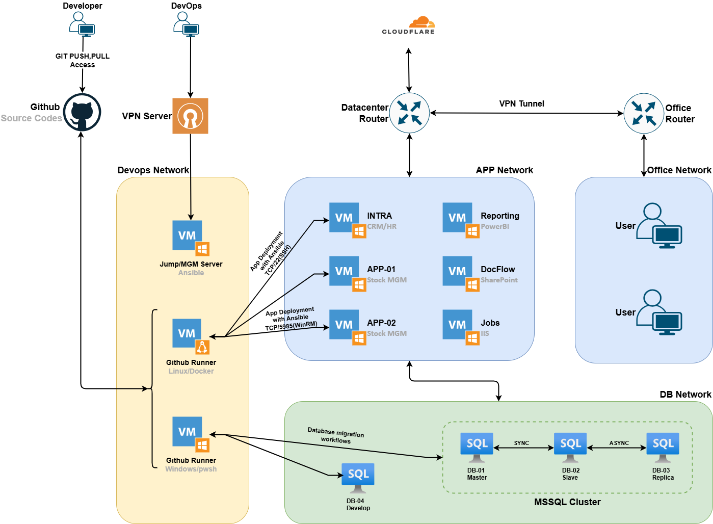
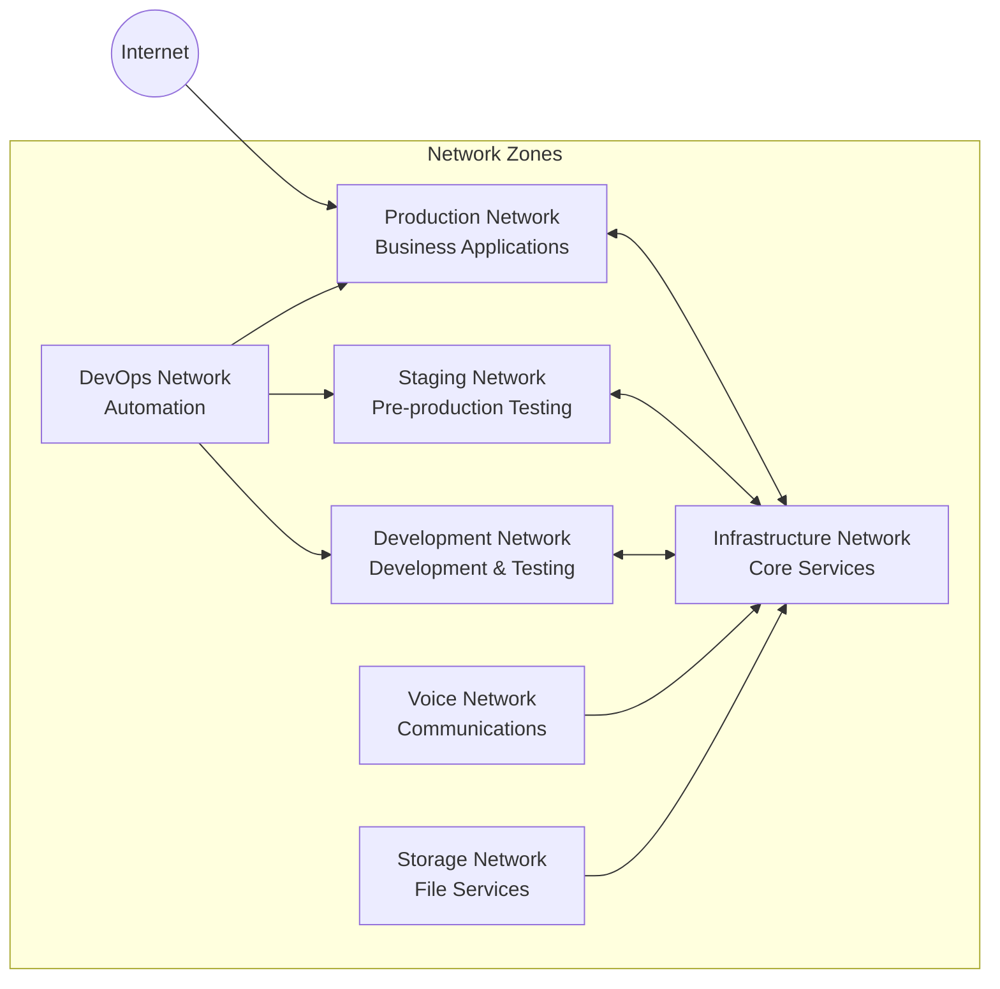
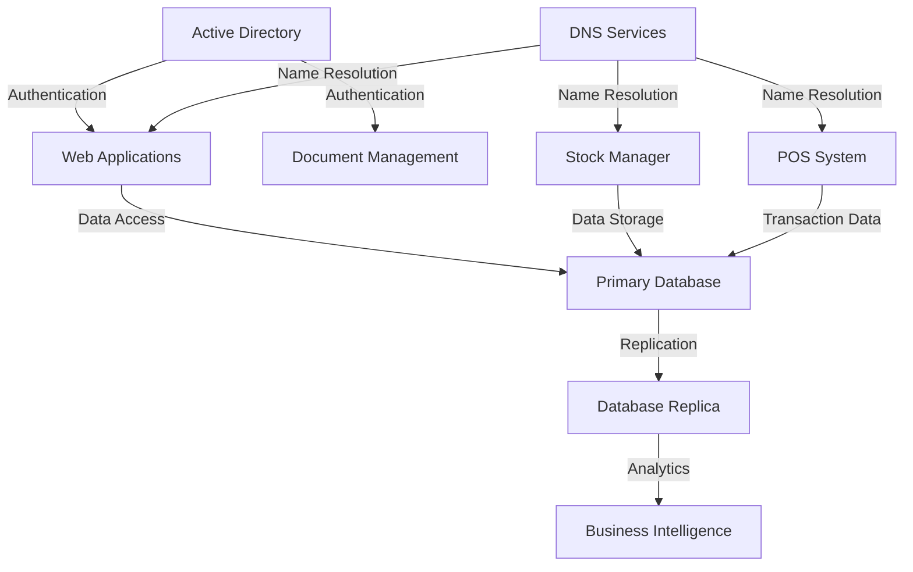

# Infrastructure Documentation Repository

This repository contains documentation for a typical enterprise infrastructure setup, serving as a reference architecture for multi-tier environments. The documentation is sanitized for public sharing and contains no business-critical information.

## 📋 Repository Contents

### 📁 [infrastructure/](./infrastructure/)
- **[Networks.md](./infrastructure/Networks.md)** - Network segmentation documentation
- **[Servers.md](./infrastructure/Servers.md)** - Server inventory and roles
- **[Services.md](./infrastructure/Services.md)** - Service catalog and dependencies

## 🏗️ Infrastructure Overview

This documentation represents a typical enterprise infrastructure with the following characteristics:

### Server Inventory
- **Total Servers**: 16
- **Operating Systems**: 
  - Windows Server (12 servers)
  - Linux (4 servers)
- **Environments**: Production, Staging, Development

### Network Architecture
The infrastructure follows a segmented network approach with:

- **Production Networks** - Hosting business-critical applications and databases
- **Staging Networks** - Pre-production testing and validation environment
- **Development Networks** - Supporting development and testing activities
- **Special Networks** - Voice communications and storage systems
- **DevOps Networks** - Automation and deployment infrastructure

### Service Categories

#### Core Business Services
- Stock Management System
- Point of Sale (POS) System
- Document Management
- Business Intelligence & Reporting

#### Infrastructure Services
- Active Directory Domain Services
- DNS & DHCP Services
- Web Services (IIS)
- Database Services (SQL Server)

#### Communication Services
- VoIP Telephony
- Internal Communication Systems

#### Automation Services
- Scheduled Job Processing
- Batch Data Processing

### Global Diagram

The complete infrastructure architecture is visualized in the diagram below, showing all network segments, servers, services, and their interconnections:

<picture>
  <source media="(prefers-color-scheme: dark)" srcset="./images/diagram-dark.png">
  <source media="(prefers-color-scheme: light)" srcset="./images/diagram-light.png">
  
</picture>

## 🔒 Security & Architecture

### Network Segmentation

### Service Dependencies

## 📊 Key Statistics

| Category | Count |
|----------|-------|
| Total Servers | 16 |
| Production Services | 19 |
| Staging Services | 1 |
| Development Services | 1 |
| Infrastructure Services | 4 |
| Business Applications | 8 |
| Network Segments | 7 |

## 🚀 Technology Stack

### Operating Systems
- **Windows Server** (Primary platform)
  - Domain Controllers
  - Application Servers  
  - Database Servers
  - Web Servers

- **Linux** (Specialized services)
  - VoIP Systems
  - Automation Services
  - Document Management

### Key Technologies
- **Virtualization**: Enterprise virtualization platform
- **Database**: SQL Server with high availability
- **Web Services**: IIS with load balancing
- **Authentication**: Active Directory
- **Automation**: Scheduled job processing
- **Communication**: VoIP telephony system

## 📚 Documentation Structure

This repository follows a structured approach to infrastructure documentation:

1. **Network Documentation** - Logical network design and segmentation
2. **Server Documentation** - Hardware inventory and server roles  
3. **Service Documentation** - Application and service catalog
4. **Architecture Documentation** - High-level system design

## 🎯 Use Cases

This documentation can serve as a reference for:

- **Infrastructure Planning** - Understanding typical enterprise setups
- **Architecture Design** - Multi-tier application architectures
- **Documentation Standards** - Best practices for infrastructure documentation
- **Educational Purposes** - Learning enterprise infrastructure concepts

## 📝 Notes

- All sensitive information has been sanitized for public sharing
- Server names and network details are generalized examples
- This represents a typical small-to-medium enterprise setup
- Documentation follows industry standard practices

---

**Repository Purpose**: Public reference architecture documentation  
**Classification**: Public - Educational/Reference Use  
**Last Updated**: August 2025