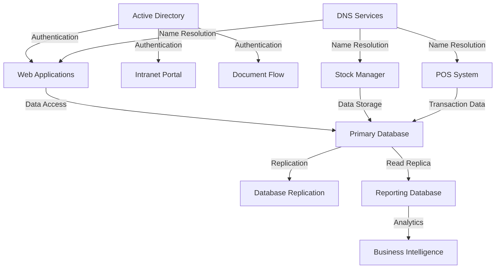

# Services Inventory

## Core Business Services

| Service Name | Description | Hosting Server(s) | Network | Port/Protocol | Status |
|--------------|-------------|-------------------|---------|---------------|--------|
| **Stock Manager** | Inventory and stock management system | app01-prod, app02-prod | App-Prod | HTTPS/443, HTTP/80 | Production |
| **POS System** | Point of Sale transaction processing | app01-prod, app02-prod | App-Prod | HTTPS/443 | Production |

## Infrastructure Services

| Service Name | Description | Hosting Server(s) | Network | Port/Protocol | Status |
|--------------|-------------|-------------------|---------|---------------|--------|
| **Active Directory** | Domain authentication and authorization | dc01, dc02 | Infrastructure | LDAP/389, LDAPS/636 | Production |
| **DNS Services** | Domain name resolution | dc01, dc02 | Infrastructure | DNS/53 | Production |
| **DHCP Services** | Dynamic IP address assignment | dc01, dc02 | Infrastructure | DHCP/67-68 | Production |
| **File Services** | Centralized file storage and sharing | dc01, dc02 | Storage | SMB/445, NFS/2049 | Production |

## Database Services

| Service Name | Description | Hosting Server(s) | Network | Port/Protocol | Status |
|--------------|-------------|-------------------|---------|---------------|--------|
| **Primary Database** | Main production database | db01-master | DB-Prod | SQL/1433 | Production |
| **Database Replication** | Master-slave replication | db02-slave | DB-Prod | SQL/1433 | Production |
| **Reporting Database** | Read-only reporting replica | db03-replica | DB-Prod | SQL/1433 | Production |

## Web Services

| Service Name | Description | Hosting Server(s) | Network | Port/Protocol | Status |
|--------------|-------------|-------------------|---------|---------------|--------|
| **Web Applications** | Business web applications | iis01, iis02 | App-Prod | HTTPS/443, HTTP/80 | Production |
| **Load Balancing** | Web traffic distribution | iis01, iis02 | App-Prod | HTTP/80, HTTPS/443 | Production |
| **Intranet Portal** | Employee portal and CRM | intra | App-Prod | HTTPS/443 | Production |

## Business Applications

| Service Name | Description | Hosting Server(s) | Network | Port/Protocol | Status |
|--------------|-------------|-------------------|---------|---------------|--------|
| **Document Flow** | Document management and SharePoint | DocFlow | App-Prod | HTTPS/443 | Production |
| **Business Intelligence** | Power BI reporting and analytics | Reporting | App-Prod | HTTPS/443 | Production |
| **CRM System** | Customer relationship management | intra | App-Prod | HTTPS/443 | Production |
| **HR System** | Human resources management | intra | App-Prod | HTTPS/443 | Production |

## Communication Services

| Service Name | Description | Hosting Server(s) | Network | Port/Protocol | Status |
|--------------|-------------|-------------------|---------|---------------|--------|
| **VoIP Services** | Voice over IP telephony | pbx | Voice | SIP/5060, RTP/10000-20000 | Production |
| **Call Routing** | Internal call management | pbx | Voice | SIP/5060 | Production |

## Automation Services

| Service Name | Description | Hosting Server(s) | Network | Port/Protocol | Status |
|--------------|-------------|-------------------|---------|---------------|--------|
| **Cron Jobs** | Scheduled task automation | Jobs | DevOps | Various | Production |
| **Batch Processing** | Automated data processing | Jobs | DevOps | Various | Production |

## Development Services

| Service Name | Description | Hosting Server(s) | Network | Port/Protocol | Status |
|--------------|-------------|-------------------|---------|---------------|--------|
| **Development Stock Manager** | Development environment testing | app03-dev | App-Dev | HTTP/80 | Development |

## Service Summary

- **Total Services**: 21
- **Production Services**: 19
- **Development Services**: 1
- **Infrastructure Services**: 4
- **Business Services**: 8
- **Communication Services**: 2
- **Database Services**: 3
- **Web Services**: 3
- **Automation Services**: 2

## Service Dependencies

